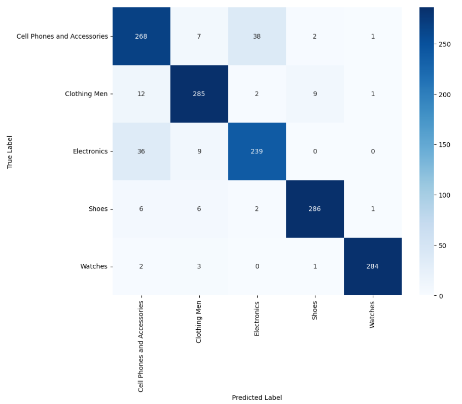
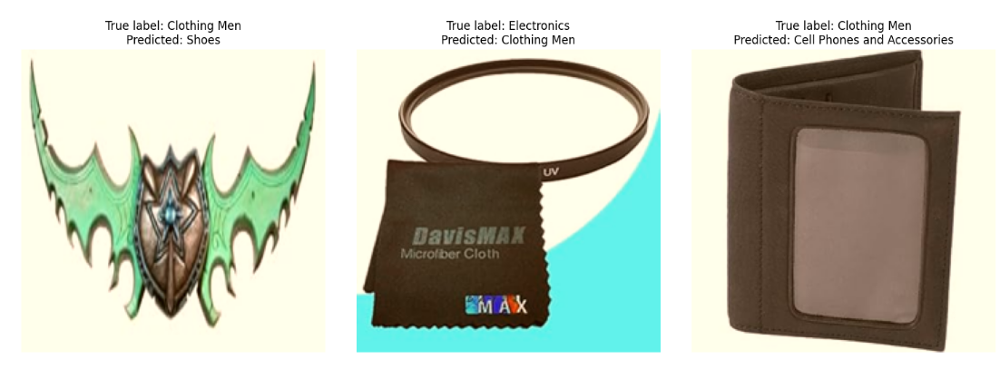

# Image Classification Using CNN

This project focuses on classifying images of products into five categories using Convolutional Neural Networks (CNNs). The dataset consists of 5000 images, each belonging to one of the following categories:
- Cell Phones and Accessories
- Clothing Men
- Electronics
- Shoes
- Watches

I experimented with 6 different CNN models: Xception, VGG16, VGG19, ResNet50, MobileNetV2, and DenseNet121. The results of these experiments are summarized in the tables below.

## Models Evaluated

| Model | Train Accuracy | Validation Accuracy | Test Accuracy |
|--------------|------|------|------|
| Xception     | 0.96 | 0.74 | 0.69 |
| VGG-16       |  1   | 0.89 | 0.86 |
| VGG-19       | 0.98 | 0.88 | 0.85 |
| ResNet50     |  1   | 0.91 | 0.9  |
| MobileNetV2  |  1   | 0.85 | 0.85 |
| DenseNet121  | 0.97 | 0.78 | 0.77 |

The ResNet50 model achieved the highest accuracy among the evaluated models.

### Confusion Matrix

### Precision, Recall and F1-Score

| Label                        | Precision | Recall | F1-Score |
|------------------------------|-----------|--------|----------|
| Cell Phones and Accessories  |    0.83   |  0.85  |   0.84   |
| Clothing Men                 |    0.92   |  0.92  |   0.92   |
| Electronics                  |    0.85   |  0.84  |   0.85   |
| Shoes                        |    0.96   |  0.95  |   0.95   |
| Watches                      |    0.99   |  0.98  |   0.98   |

### Misclassified Examples

## Conclusion

In this project, i explored different CNN architectures for classifying product images into five categories. The ResNet50 model achieved the highest accuracy. Further improvements can be made by tuning hyperparameters, augmenting data...
